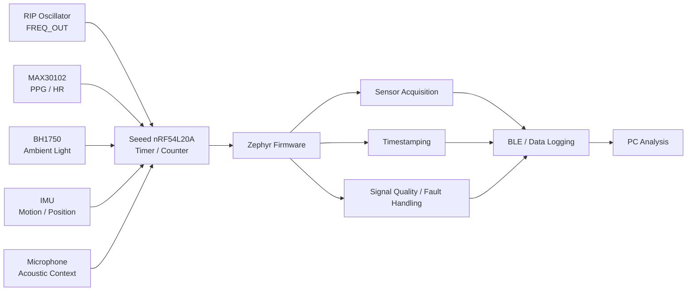
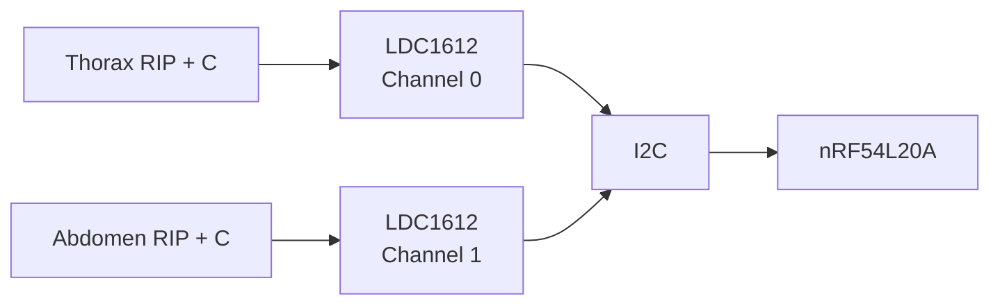
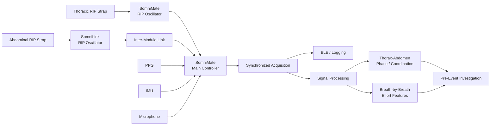

# SomniMate

**Pre-Obstructive Respiratory Signature Research Platform**

SomniMate is an engineering R&D project I am developing to investigate a specific question:

> **Can changes in thoracic and abdominal respiratory mechanics reveal a repeatable signature before an obstructive respiratory event?**

I am approaching the project as a hardware-first investigation. My priority is to acquire good respiratory data, understand the signal chain and test the hypothesis before making predictive claims.

> **Project status:** active research and development. Firmware and sensor bring-up are in progress, and I have now started the first custom RIP front-end design in Altium.
>
> SomniMate is not a diagnostic medical device and is not intended for clinical use.

---

## Research concept

Thoracic and abdominal respiratory effort provide two related but independent views of breathing mechanics.

By measuring both channels together I want to investigate:

- respiratory effort amplitude
- breath-to-breath effort trends
- thorax-abdomen timing
- phase and coordination
- temporary respiratory discordance
- paradoxical movement
- waveform morphology
- changes occurring before, during and after respiratory events

I will use supporting signals such as PPG, movement, position, audio and ambient light as additional context rather than primary respiratory measurements.

I am not assuming that thoraco-abdominal paradox occurs before an obstructive event. The purpose of the project is to determine experimentally whether useful and repeatable pre-event changes are present.

---

## Development strategy

I am developing SomniMate as a staged engineering project. I first established the Nordic/Zephyr firmware and modular sensor platform, and I am now developing the respiratory-effort electronics separately so I can characterise the RIP measurement chain from first principles.


My immediate engineering goal is not a finished wearable. It is to establish a reliable single-channel respiratory-effort signal chain, understand its electrical and mechanical behaviour, and use measured results to drive the later integrated hardware.

---

## Firmware and sensor prototype

For the current development platform I am using:

- **Seeed nRF54L20A development board** — main controller and firmware platform
- **ADS1115 development board** — general analog acquisition and firmware development; no longer required in the primary RIP signal path
- **MAX30102 development board** — experimental PPG / heart-rate / SpO₂ channel
- **BH1750 development board** — ambient-light and recording-context channel
- IMU for movement and position
- microphone for acoustic / snoring investigation
- Zephyr firmware
- BLE / data logging



I originally evaluated the ADS1115 as part of the respiratory acquisition path. After selecting a frequency-output RIP architecture, I no longer need an ADC in the primary RIP channel. The nRF54L20A can measure the oscillator frequency directly using a hardware timer/counter.

**[View the current firmware development](firmware/)**

---

## Custom RIP front-end prototype

I have started the first custom respiratory inductance plethysmography front-end design in Altium.

For Rev A I am deliberately designing **one respiratory channel only**. I want to build and characterise one RIP belt interface before duplicating it for synchronized thoracic and abdominal measurements.

### Design criteria

For this prototype I am prioritising:

- small physical size
- low power consumption
- 3.3 V operation
- low component count
- low BOM cost
- direct compatibility with the nRF54L20A
- easy duplication for a second RIP channel
- relative respiratory-effort measurement rather than calibrated lung-volume measurement
- firmware baseline calibration
- tolerance of belt-to-belt inductance variation
- accessible test points and straightforward debug
- low-voltage battery-powered wearable operation
- non-clinical R&D use rather than medical-grade accuracy

### Architecture choice

I considered several ways of measuring the RIP belt:

1. discrete LC oscillator with digital frequency measurement
2. dedicated inductance-to-digital conversion, including the TI LDC1612
3. oscillator followed by frequency-to-voltage conversion and ADC
4. synchronous analog excitation/demodulation

For the first prototype I selected a **discrete Colpitts LC oscillator**.

I chose this approach because it keeps the sensing principle visible, has a low component count, can be made small and low power, and lets me measure the RIP belt directly as a change in oscillator frequency. It also gives me more useful analog-design and simulation work than using a dedicated inductance-to-digital IC for the first revision.

The working signal chain is now:


This means I do **not** need a conventional analog anti-alias filter, unity-gain op-amp buffer or ADS1115 in the primary RIP path. I am not sampling an analog respiration voltage; I am measuring the timing of oscillator edges digitally.

I will still isolate and condition the oscillator output before the MCU. My current plan is to use a small Schmitt-input logic buffer so the oscillator is not unnecessarily loaded and the Nordic receives clean digital edges.

---

## First-pass calculations

I do not yet have an LCR meter or measured electrical data for the RIP belt, so I am treating the initial belt model as a **design assumption**, not a measured value.

For the first calculation pass I used:

- supply voltage: **3.3 V**
- assumed nominal RIP belt inductance: **2 µH**
- provisional design range: **1.5 µH to 2.5 µH**
- Colpitts capacitors: **C1 = 10 nF, C2 = 10 nF**

The equivalent Colpitts capacitance I calculated is:

```text
Ceq = (C1 × C2) / (C1 + C2)
    = (10 nF × 10 nF) / (10 nF + 10 nF)
    = 5 nF
```

Using the standard LC resonance relationship:

```text
f0 = 1 / (2π√(LC))
```

with my provisional **2 µH** belt value and **5 nF** equivalent capacitance gives a nominal frequency of approximately:

**1.59 MHz**

For the assumed inductance range I calculate approximately:

| RIP belt inductance | Calculated oscillator frequency |
|---:|---:|
| 1.5 µH | 1.84 MHz |
| 2.0 µH | 1.59 MHz |
| 2.5 µH | 1.42 MHz |

As a simple sensitivity example, if the belt inductance increased by 5% from **2.0 µH to 2.1 µH**, the calculated frequency changes from approximately **1.592 MHz to 1.553 MHz**, a shift of about **38 kHz**.

I am using these values only to establish a sensible first simulation and schematic. I will replace the assumed belt model with measured values once I have prototype hardware and suitable test equipment.

---

## LTspice verification plan

Before committing the oscillator to PCB layout I will reproduce the first-pass design in LTspice.

I intend to use the simulation to check:

- oscillator startup
- steady-state waveform
- nominal oscillation frequency
- transistor bias/current
- output amplitude
- belt inductance sweep from 1.5 µH to 2.5 µH
- sensitivity of frequency to inductance change
- capacitor tolerance
- 3.3 V supply variation
- belt series resistance / resonator loss sensitivity
- loading introduced by the output buffer

The LTspice results will then be compared with the hand calculations before I finalise the Altium schematic.

---

## Dedicated inductance-to-digital alternative

I also considered the **TI LDC1612** as an alternative architecture. A two-channel inductance-to-digital converter is attractive because one IC could potentially measure both the thoracic and abdominal resonant sensors and send the results to the Nordic over I²C.

Conceptually:



I have not selected the LDC1612 for Rev A because the electrical characteristics of the large wearable RIP belt are still unknown, including inductance, parasitic capacitance, AC resistance and resonator Q. I want the first prototype to expose these behaviours rather than hide them behind a dedicated converter.

If the discrete prototype proves the belt characteristics and the LDC1612 operating range is suitable, I can revisit it as a later size/power/component-count optimisation.

---

## Altium hardware project

I created a dedicated Altium project for the RIP front-end work:

`hardware/SomniMate_RIP_AFE_Prototype/`

I organised it as:

```text
SomniMate_RIP_AFE_Prototype/
├── Draftsman/
├── Libraries/
├── Outputs/
├── PCB/
├── Schematic/
├── README.md
└── SomniMate_RIP_AFE_Prototype.PrjPcb
```

**[View the hardware development](hardware/)**

The first hardware milestone is a clean, repeatable single-channel frequency shift that tracks controlled RIP belt movement. Only after I have characterised that signal chain will I duplicate it for synchronized thoracic and abdominal channels.

---

## Intended dual-channel architecture

The later system is intended to contain two coordinated respiratory-effort modules:

- **SomniMate** — main controller and first respiratory-effort channel
- **SomniLink** — second respiratory-effort channel



I have intentionally not fixed the eventual SomniLink-to-SomniMate interface yet. Synchronization, signal quality, size and power will drive that decision.

---

## Wearable concept

My current mechanical concept uses separate thoracic and abdominal effort straps with a centrally mounted controller. It is an early development concept intended to explore sensor placement, cable routing and wearable integration rather than final industrial design.


**[View image in assets](assets/images/somnimate_wearable_concept.jpg)**

---

## Supporting sensors

### MAX30102

I am using the MAX30102 experimentally for:

- PPG waveform acquisition
- heart rate
- pulse amplitude changes
- experimental SpO₂ investigation

I am treating SpO₂ as experimental until the complete optical implementation and measurement method have been validated.

### IMU

I am using the IMU to investigate:

- body position
- posture changes
- movement detection
- motion artefacts

### Microphone

I am using the microphone experimentally for:

- snoring
- airway acoustic activity
- respiratory-event context

### BH1750

I added the BH1750 as a contextual sensor rather than a primary respiratory sensor. It can provide ambient-light level, lights-on / lights-off transitions and additional timestamped context during recordings while also giving me another useful I²C peripheral during firmware development.

---

## Experimental sequence

I plan to progress through increasingly realistic measurements:

1. **Calculation and LTspice verification** — establish a credible oscillator design before PCB layout.
2. **AFE bench verification** — verify startup, frequency range, current consumption and digital output using one RIP channel.
3. **Controlled awake recordings** — normal breathing, deeper breathing, breath holds, movement and posture changes.
4. **Dual-channel integration** — add the second effort channel and establish synchronized thoracic and abdominal acquisition.
5. **Resting / pre-sleep recordings** — evaluate signal stability, timestamps and data integrity.
6. **Overnight exploratory recordings** — acquire longer datasets and identify artefacts.
7. **Event-labelled recordings** — use a credible reference for event timing before drawing conclusions about pre-event behaviour.
8. **Feature analysis** — compare periods before events with normal/control breathing.
9. **Repeatability analysis** — determine whether candidate features repeat across events and nights.

---

## Development status

### Firmware and modular sensors

- [x] Core research question defined
- [x] Nordic / Zephyr environment established
- [x] Initial firmware bring-up
- [x] I²C communication established
- [x] ADS1115 evaluated
- [x] MAX30102 evaluated
- [x] Integrate ADS1115 and MAX30102 into common application
- [x] Add BH1750
- [x] Integrate IMU
- [x] Integrate microphone
- [ ] Implement synchronized timestamping
- [ ] Implement structured data logging
- [ ] Add RIP frequency measurement using Nordic timer/counter

### RIP front end

- [x] Create dedicated Altium RIP prototype project
- [x] Establish schematic / PCB / library / output project structure
- [x] Define Rev-A design criteria
- [x] Compare discrete and dedicated inductance-conversion architectures
- [x] Select discrete Colpitts oscillator for Rev A
- [x] Establish provisional 2 µH belt model and first-pass LC calculations
- [ ] Select and bias the active oscillator device
- [ ] Select the Schmitt / logic output buffer
- [ ] Build the LTspice model
- [ ] Run inductance and tolerance sweeps
- [ ] Complete the Altium schematic
- [ ] Design the prototype PCB
- [ ] Assemble and bring up the prototype
- [ ] Characterise actual belt inductance / sensitivity / losses
- [ ] Capture controlled respiratory waveforms

### Dual-channel SomniMate / SomniLink hardware

- [ ] Convert measured single-channel results into the dual-channel architecture
- [ ] Design SomniMate controller hardware
- [ ] Design SomniLink hardware
- [ ] Define inter-module communication
- [ ] Build and bring up custom PCBs
- [ ] Verify synchronized thoracic / abdominal operation
- [ ] Evaluate wearable implementation
- [ ] Begin overnight dual-channel data collection
- [ ] Perform thoraco-abdominal phase / coordination analysis

---

**SomniMate is an independent research and engineering project. It is not a diagnostic or therapeutic medical device.**
