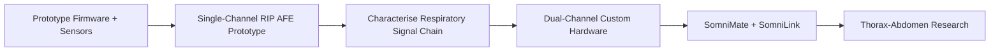
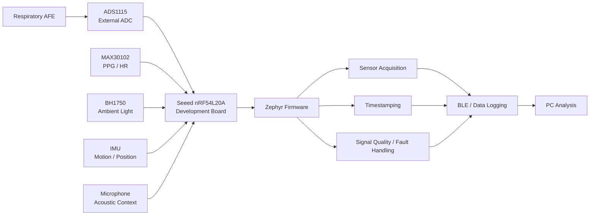
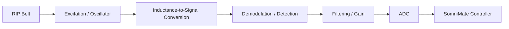
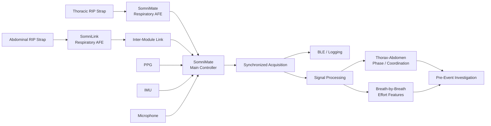

# SomniMate

**Pre-Obstructive Respiratory Signature Research Platform**

SomniMate is an engineering R&D project I am developing to investigate a specific question:

> **Can changes in thoracic and abdominal respiratory mechanics reveal a repeatable signature before an obstructive respiratory event?**

The project combines dual respiratory-effort sensing with supporting physiological and contextual measurements. The emphasis is on acquiring good data, understanding the signals and testing the hypothesis before making predictive claims.

> **Project status:** active research and development. Firmware and sensor bring-up are in progress, and development of the first custom RIP analog front-end prototype has now started.
>
> SomniMate is not a diagnostic medical device and is not intended for clinical use.

---

## Research concept

Thoracic and abdominal respiratory effort provide two related but independent views of breathing mechanics.

By measuring both channels together I can investigate:

- respiratory effort amplitude
- breath-to-breath effort trends
- thorax-abdomen timing
- phase and coordination
- temporary respiratory discordance
- paradoxical movement
- waveform morphology
- changes occurring before, during and after respiratory events

Supporting signals such as PPG, movement, position, audio and ambient light provide additional context.

The aim is not to assume that thoraco-abdominal paradox occurs before an obstructive event. The project is intended to determine experimentally whether useful and repeatable changes are present.

---

## Development strategy

SomniMate is being developed as a staged engineering project. The firmware and modular sensor platform establish the acquisition environment, while the respiratory-effort electronics are being developed separately so that the RIP measurement chain can be characterised from first principles.



The immediate engineering goal is not a finished wearable. It is to establish a reliable respiratory-effort signal chain, understand its electrical and mechanical behaviour, and use measured results to drive the later integrated hardware.

---

## Firmware and sensor prototype

The current development platform is based around:

- **Seeed nRF54L20A development board** — main controller and firmware platform
- **ADS1115 development board** — external ADC for analog signal acquisition and bench development
- **MAX30102 development board** — experimental PPG / heart-rate / SpO₂ channel
- **BH1750 development board** — ambient-light and recording-context channel
- IMU for movement and position
- microphone for acoustic / snoring investigation
- Zephyr firmware
- BLE / data logging



This platform allows each interface to be brought up and tested independently before the complete respiratory system is integrated.

**[View the current firmware development](firmware/)**

---

## Custom RIP analog front-end prototype

Development of the first custom respiratory inductance plethysmography front end is now underway in Altium.

The first objective is deliberately limited to **one respiratory channel**. A single RIP belt and analog front end will be designed, built and characterised before the architecture is duplicated for synchronized thoracic and abdominal measurements.

The working signal chain is:



The design work will focus on:

- RIP belt excitation and inductance measurement
- conversion of small belt inductance changes into a stable electrical signal
- demodulation / detection method
- analog filtering and gain
- output range and ADC interface
- noise and drift
- sensitivity to belt placement and movement
- power consumption
- EMC considerations
- bench testability and accessible measurement points

The current Altium project is:

`hardware/SomniMate_RIP_AFE_Prototype/`

with the project organised into:

```text
SomniMate_RIP_AFE_Prototype/
├── Draftsman/
├── Libraries/
├── Outputs/
├── PCB/
├── Schematic/
├── README.md
└── SomniMate_RIP_AFE_Prototype.PrjPcb
```

**[View the hardware development](hardware/)**

The first milestone is a clean, repeatable single-channel respiration waveform. Only after that signal chain has been characterised will the design move to two synchronized effort channels.

---

## Intended dual-channel architecture

The later system is intended to contain two coordinated respiratory-effort channels:

- **SomniMate** — main controller and first respiratory-effort channel
- **SomniLink** — second respiratory-effort channel



The exact SomniLink-to-SomniMate interface has intentionally not yet been fixed. Synchronization and signal quality are the key system requirements.

---

## Wearable concept

The current mechanical concept uses separate thoracic and abdominal effort straps with a centrally mounted controller. It is an early development concept intended to explore sensor placement, cable routing and wearable integration rather than final industrial design.


**[View image in assets](assets/images/somnimate_wearable_concept.jpg)**

---

## Supporting sensors

### MAX30102

Used experimentally for:

- PPG waveform acquisition
- heart rate
- pulse amplitude changes
- experimental SpO₂ investigation

SpO₂ is treated as experimental until the complete optical implementation and measurement method have been validated.

### IMU

Used to investigate:

- body position
- posture changes
- movement detection
- motion artefacts

### Microphone

Used experimentally for:

- snoring
- airway acoustic activity
- respiratory-event context

### BH1750

The BH1750 is a contextual sensor rather than a primary respiratory sensor. It can provide ambient-light level, lights-on / lights-off transitions and additional timestamped context during recordings while also providing another useful I²C peripheral during firmware development.

---

## Experimental sequence

The investigation will progress through increasingly realistic measurements:

1. **AFE bench verification** — verify excitation, signal conversion, gain, filtering and stability using one RIP channel.
2. **Controlled awake recordings** — normal breathing, deeper breathing, breath holds, movement and posture changes.
3. **Dual-channel integration** — add the second effort channel and establish synchronized thoracic and abdominal acquisition.
4. **Resting / pre-sleep recordings** — evaluate signal stability, timestamps and data integrity.
5. **Overnight exploratory recordings** — acquire longer datasets and identify artefacts.
6. **Event-labelled recordings** — use a credible reference for event timing before drawing conclusions about pre-event behaviour.
7. **Feature analysis** — compare periods before events with normal/control breathing.
8. **Repeatability analysis** — determine whether candidate features repeat across events and nights.

---

## Development status

### Firmware and modular sensors

- [x] Core research question defined
- [x] Nordic / Zephyr environment established
- [x] Initial firmware bring-up
- [x] I²C communication established
- [x] ADS1115 evaluated
- [x] MAX30102 evaluated
- [x] Integrate ADS1115 and MAX30102 into common application
- [x] Add BH1750
- [x] Integrate IMU
- [x] Integrate microphone
- [ ] Implement synchronized timestamping
- [ ] Implement structured data logging
- [ ] Integrate respiratory sensing

### RIP analog front end

- [x] Create dedicated Altium RIP AFE prototype project
- [x] Establish schematic / PCB / library / output project structure
- [ ] Define the single-channel RIP AFE architecture
- [ ] Design the excitation / oscillator stage
- [ ] Design the detection / demodulation stage
- [ ] Define filtering and gain
- [ ] Interface the AFE to the ADC
- [ ] Design the prototype PCB
- [ ] Assemble and bring up the prototype
- [ ] Characterise sensitivity, noise, drift and movement artefacts
- [ ] Capture controlled respiratory waveforms

### Dual-channel SomniMate / SomniLink hardware

- [ ] Convert measured single-channel requirements into the dual-channel architecture
- [ ] Design SomniMate controller hardware
- [ ] Design SomniLink hardware
- [ ] Define inter-module communication
- [ ] Build and bring up custom PCBs
- [ ] Verify synchronized thoracic / abdominal operation
- [ ] Evaluate wearable implementation
- [ ] Begin overnight dual-channel data collection
- [ ] Perform thoraco-abdominal phase / coordination analysis

---

**SomniMate is an independent research and engineering project. It is not a diagnostic or therapeutic medical device.**
