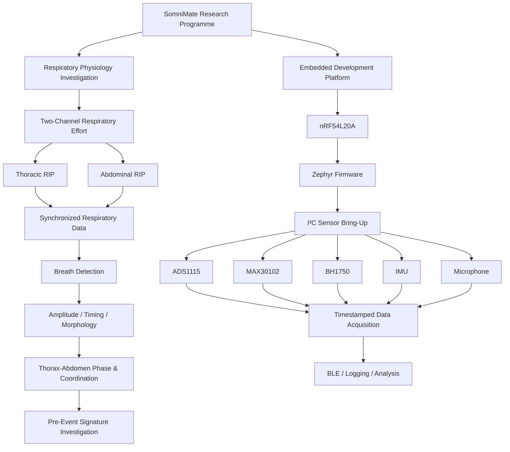
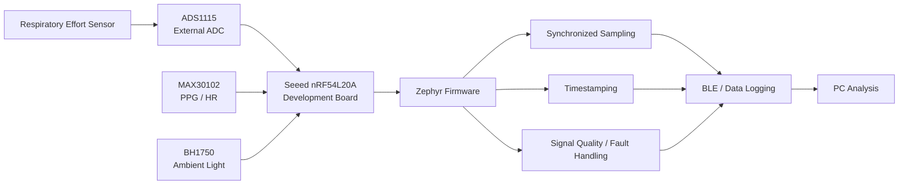
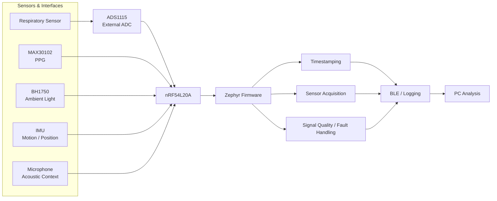
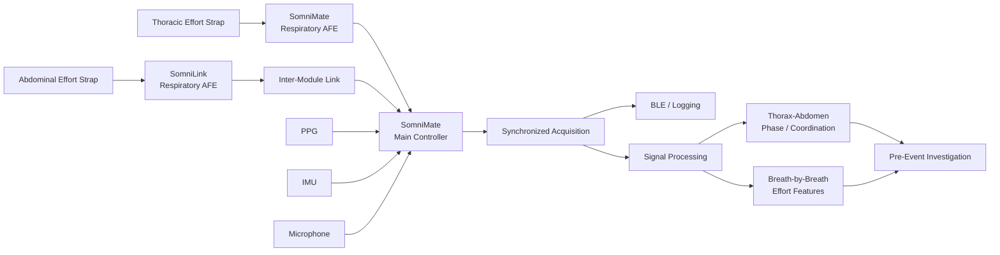

# SomniMate

**Pre-Obstructive Respiratory Signature Research Platform**

SomniMate is an engineering R&D project I am developing to investigate a specific question:

> **Can changes in thoracic and abdominal respiratory mechanics reveal a repeatable
> signature before an obstructive respiratory event?**

The project combines dual respiratory-effort sensing with supporting physiological
and contextual measurements.

The emphasis is on acquiring good data, understanding the signals and testing the
hypothesis before committing to custom hardware or making predictive claims.

> **Project status:** active research and development.  
> SomniMate is not a diagnostic medical device and is not intended for clinical use.

---

## Research concept

Thoracic and abdominal respiratory effort provide two related but independent
views of breathing mechanics.

By measuring both channels together I can investigate:

- respiratory effort amplitude
- breath-to-breath effort trends
- thorax-abdomen timing
- phase and coordination
- temporary respiratory discordance
- paradoxical movement
- waveform morphology
- changes occurring before, during and after respiratory events

Supporting signals such as PPG, movement, position, audio and ambient light provide
additional context.

The aim is not to assume that thoraco-abdominal paradox occurs before an
obstructive event. The project is intended to determine experimentally whether
useful and repeatable changes are present.

---

## Development architecture

The project currently has two parallel development paths:

The respiratory investigation and embedded-development work can progress
independently.

This avoids making custom electronics a prerequisite for answering the core
research question.

---

## Phase 1 — Respiratory physiology prototype

The first phase of SomniMate is based on a modular embedded prototype.
The purpose of this phase is to establish the complete acquisition chain and begin
collecting respiratory and supporting physiological signals using readily available
development boards before designing custom SomniMate hardware.

The prototype is built around:

- **Seeed nRF54L20A development board** — main controller and firmware platform
- **ADS1115 development board** — external ADC for the respiratory-effort signal
- **MAX30102 development board** — experimental PPG / heart-rate / SpO₂ channel
- **BH1750 development board** — ambient-light and recording-context channel
- respiratory-effort sensor interface
- Zephyr firmware for acquisition, timing and communications

The initial objective is not to produce a finished wearable. It is to create a
known-good development platform where each sensor interface can be brought up,
tested and characterised independently.

The ADS1115 provides the first analog acquisition path for respiratory-effort
experimentation. The MAX30102 and BH1750 provide supporting physiological and
environmental context while also exercising the shared embedded acquisition
framework.

Once the basic firmware and sensor interfaces are stable, the prototype will be
used to investigate:

- respiratory waveform acquisition
- sampling rate and timing requirements
- signal amplitude and noise
- filtering requirements
- motion and environmental artefacts
- synchronization between respiratory and supporting signals
- reliable timestamped logging

The results from this phase will define the requirements for the later custom
SomniMate respiratory analog front end and, eventually, the second **SomniLink**
respiratory-effort channel.

---

## Embedded prototype

In parallel with the respiratory investigation, I am developing the embedded
platform that can later become the basis of SomniMate hardware.

The current prototype uses:

- **nRF54L20A** development platform
- **ADS1115** external ADC module
- **MAX30102** PPG sensor
- **BH1750** ambient light sensor
- IMU for movement and position
- microphone for acoustic / snoring investigation
- Zephyr firmware
- BLE / data logging

### Prototype architecture

The ADS1115 provides a convenient external ADC for early development and sensor
experimentation. It is a prototype component rather than a commitment to the final
SomniMate analog architecture.

---

## Firmware bring-up

The embedded work is deliberately being developed incrementally.

Current firmware objectives are:

1. bring up the nRF54L20A development platform
2. establish the Zephyr build, flash and debug environment
3. verify console output
4. bring up the I²C bus
5. communicate reliably with the ADS1115
6. integrate the MAX30102
7. integrate the BH1750
8. integrate movement / position sensing
9. establish synchronized sensor sampling
10. timestamp acquired data
11. detect dropped or invalid samples
12. stream or log the acquired data
13. integrate the respiratory sensing path

This creates a known-good embedded platform before the respiratory electronics are
moved onto custom hardware.

---

## Why include ambient light?

The **BH1750** is not a primary respiratory sensor.

It is included as a low-cost contextual channel that can provide:

- ambient light level
- lights-on / lights-off transitions
- environmental context during recordings
- an additional I²C device for firmware development and bus testing

It can therefore provide useful metadata without adding significant complexity.

---

## Supporting physiology

### MAX30102

The MAX30102 is being used experimentally for:

- PPG waveform acquisition
- heart rate
- pulse amplitude changes
- experimental SpO₂ investigation

SpO₂ is treated as experimental until the complete optical implementation and
measurement method have been validated.

### IMU

The IMU can provide:

- body position
- posture changes
- movement detection
- motion artefact context

### Microphone

The microphone can be investigated for:

- snoring
- airway acoustic activity
- event context

These channels are supporting measurements.

The primary signals remain the **thoracic and abdominal respiratory-effort
waveforms**.

---

## Target SomniMate architecture

If the respiratory investigation justifies custom hardware, the platform can
progress toward two coordinated wearable modules:

- **SomniMate** — main controller and first respiratory-effort channel
- **SomniLink** — second respiratory-effort channel

The exact SomniLink-to-SomniMate interface has intentionally not yet been fixed.

The important system requirement is accurate synchronization between the thoracic
and abdominal respiratory-effort channels.

---

## Experimental sequence

The investigation will progress through increasingly realistic measurements:

1. **Bench verification**  
   Confirm that both respiratory channels respond independently and consistently.

2. **Controlled awake recordings**  
   Normal breathing, deeper breathing, breath holds, movement and posture changes.

3. **Resting / pre-sleep recordings**  
   Evaluate signal stability, comfort, timestamps and data integrity.

4. **Overnight exploratory recordings**  
   Acquire longer dual-effort datasets and identify artefacts.

5. **Event-labelled recordings**  
   Use a credible reference for event timing before drawing conclusions about
   pre-event behaviour.

6. **Feature analysis**  
   Compare periods before events with normal/control breathing.

7. **Repeatability analysis**  
   Determine whether candidate features repeat across events and nights.

---

## Candidate signal features

Initial analysis will remain simple and interpretable.

Candidate measurements include:

- respiratory rate
- breath interval
- thoracic peak-to-peak amplitude
- abdominal peak-to-peak amplitude
- change in effort across successive breaths
- inspiratory / expiratory timing
- waveform morphology
- thorax-abdomen lag
- phase
- correlation
- coordination
- temporary discordance
- paradox-like movement
- body position
- motion state
- PPG heart-rate response
- PPG pulse-amplitude changes

Machine learning is not required for the initial investigation.

The first objective is to understand what the signals themselves are showing.

---

## Engineering areas

SomniMate brings together:

- analog sensing
- ADC acquisition
- respiratory-effort measurement
- embedded C
- Nordic nRF development
- Zephyr RTOS
- I²C interfaces
- BLE
- data structures and buffering
- timestamping and synchronization
- mixed-signal electronics
- signal processing
- feature extraction
- artefact rejection
- bench verification
- wearable electronics
- experimental design

---

## Development status

### Research

- [x] Core research question defined
- [x] Dual thorax / abdomen sensing selected
- [x] Respiratory-effort technology investigated
- [x] Initial experimental architecture defined
- [ ] Acquire first controlled dual-RIP dataset
- [ ] Produce synchronized thorax / abdomen plots
- [ ] Define initial breath features
- [ ] Begin overnight exploratory recording
- [ ] Establish credible event-labelling method
- [ ] Evaluate pre-event repeatability

### Embedded platform

- [x] Nordic / Zephyr environment established
- [x] Initial firmware bring-up
- [x] I²C communication established
- [x] ADS1115 evaluated
- [x] MAX30102 evaluated
- [ ] Integrate ADS1115 and MAX30102 into common application
- [ ] Add BH1750
- [ ] Integrate IMU
- [ ] Integrate microphone
- [ ] Implement synchronized timestamping
- [ ] Implement structured data logging
- [ ] Integrate respiratory sensing

### Future custom hardware

- [ ] Characterise respiratory front-end requirements
- [ ] Develop single-channel respiratory AFE
- [ ] Develop SomniMate hardware
- [ ] Develop SomniLink hardware
- [ ] Verify synchronized dual-channel operation
- [ ] Evaluate wearable implementation

---

## What would count as success?

A positive result does not simply mean finding an unusual waveform.

A potentially useful result would need to demonstrate:

- measurable lead time before an event
- repeatability across multiple events
- acceptable false-positive behaviour
- persistence across multiple nights
- useful information beyond a single respiratory channel
- physiological and signal-level interpretability

A negative or inconclusive result is also valuable if the experiment is
well-designed and documented.

---

## Repository scope

This public repository is the portfolio-facing engineering record of SomniMate.

It will contain selected:

- system architecture
- block diagrams
- firmware milestones
- hardware development
- test methods
- signal plots
- analysis results
- engineering decisions
- lessons learned

Detailed working material, raw data and experimental development files are
maintained separately.

---

## Why I am building it

SomniMate combines the areas of electronics engineering I most enjoy:

**analog sensing, embedded hardware, firmware, PCB design, signal processing and
real-world measurement.**

It also provides a useful engineering problem where the answer is not known in
advance.

My approach is to define the question, build the minimum system required to test
it, collect evidence and allow the results to determine what gets developed next.

---

**SomniMate is an independent research and engineering project. It is not a
diagnostic or therapeutic medical device.**
