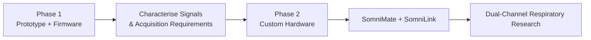
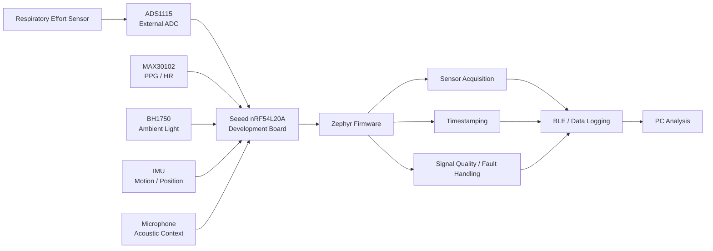
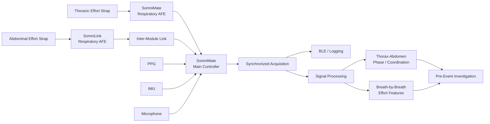

# SomniMate

**Pre-Obstructive Respiratory Signature Research Platform**

SomniMate is an engineering R&D project I am developing to investigate a specific question:

> **Can changes in thoracic and abdominal respiratory mechanics reveal a repeatable signature before an obstructive respiratory event?**

The project combines dual respiratory-effort sensing with supporting physiological and contextual measurements. The emphasis is on acquiring good data, understanding the signals and testing the hypothesis before making predictive claims.

> **Project status:** active research and development.  
> SomniMate is not a diagnostic medical device and is not intended for clinical use.

---

## Research concept

Thoracic and abdominal respiratory effort provide two related but independent views of breathing mechanics.

By measuring both channels together I can investigate:

- respiratory effort amplitude
- breath-to-breath effort trends
- thorax-abdomen timing
- phase and coordination
- temporary respiratory discordance
- paradoxical movement
- waveform morphology
- changes occurring before, during and after respiratory events

Supporting signals such as PPG, movement, position, audio and ambient light provide additional context.

The aim is not to assume that thoraco-abdominal paradox occurs before an obstructive event. The project is intended to determine experimentally whether useful and repeatable changes are present.

---

## Development plan

SomniMate is being developed in two clear engineering phases.

### Phase 1 — Prototype and firmware

The first phase uses modular development boards to establish the complete acquisition chain before custom electronics are designed.

The prototype is built around:

- **Seeed nRF54L20A development board** — main controller and firmware platform
- **ADS1115 development board** — external ADC for respiratory-effort signal acquisition
- **MAX30102 development board** — experimental PPG / heart-rate / SpO₂ channel
- **BH1750 development board** — ambient-light and recording-context channel
- respiratory-effort sensor interface
- IMU for movement and position
- microphone for acoustic / snoring investigation
- Zephyr firmware
- BLE / data logging

The purpose of Phase 1 is to create a known-good embedded platform where each interface can be brought up, tested and characterised independently.

Phase 1 firmware work includes:

1. bring up the nRF54L20A development platform
2. establish the Zephyr build, flash and debug environment
3. verify console output
4. bring up the I²C bus
5. communicate reliably with the ADS1115
6. integrate the MAX30102
7. integrate the BH1750
8. integrate IMU and microphone sensing
9. establish synchronized sensor sampling
10. timestamp acquired data
11. detect dropped or invalid samples
12. stream or log acquired data
13. integrate the respiratory-effort sensing path

The prototype will then be used to investigate respiratory waveform acquisition, sampling requirements, signal amplitude and noise, filtering, artefacts and synchronization between respiratory and supporting signals.

The result of Phase 1 is a set of measured requirements for the custom hardware rather than assumptions made in advance.

---

### Phase 2 — Custom hardware

Phase 2 moves from breakout boards to purpose-designed SomniMate hardware in Altium and using the requirements established during Phase 1.

The intended system contains two coordinated respiratory-effort modules:

- **SomniMate** — main controller and first respiratory-effort channel
- **SomniLink** — second respiratory-effort channel

Phase 2 will include:

- respiratory analog front-end design
- ADC and signal-chain selection
- power architecture
- sensor interfaces
- SomniMate PCB design
- SomniLink PCB design
- inter-module communication
- synchronized dual-channel acquisition
- wearable mechanical integration
- bench verification
- overnight data collection

The exact SomniLink-to-SomniMate interface has intentionally not yet been fixed. Synchronization and signal quality are the key system requirements.

---

## Supporting sensors

### MAX30102

Used experimentally for:

- PPG waveform acquisition
- heart rate
- pulse amplitude changes
- experimental SpO₂ investigation

SpO₂ is treated as experimental until the complete optical implementation and measurement method have been validated.

### IMU

Used to investigate:

- body position
- posture changes
- movement detection
- motion artefacts

### Microphone

Used experimentally for:

- snoring
- airway acoustic activity
- respiratory-event context

### BH1750

The BH1750 is a low-cost contextual sensor rather than a primary respiratory sensor. It can provide ambient-light level, lights-on / lights-off transitions and additional timestamped context during recordings while also providing another useful I²C peripheral during firmware development.

---

## Experimental sequence

The investigation will progress through increasingly realistic measurements:

1. **Bench verification** — confirm stable sensor and acquisition behaviour.
2. **Controlled awake recordings** — normal breathing, deeper breathing, breath holds, movement and posture changes.
3. **Resting / pre-sleep recordings** — evaluate signal stability, timestamps and data integrity.
4. **Overnight exploratory recordings** — acquire longer datasets and identify artefacts.
5. **Event-labelled recordings** — use a credible reference for event timing before drawing conclusions about pre-event behaviour.
6. **Feature analysis** — compare periods before events with normal/control breathing.
7. **Repeatability analysis** — determine whether candidate features repeat across events and nights.

---

## Development status

### Phase 1 — Prototype and firmware

- [x] Core research question defined
- [x] Nordic / Zephyr environment established
- [x] Initial firmware bring-up
- [x] I²C communication established
- [x] ADS1115 evaluated
- [x] MAX30102 evaluated
- [x] Integrate ADS1115 and MAX30102 into common application
- [ ] Add BH1750
- [ ] Integrate IMU
- [ ] Integrate microphone
- [ ] Implement synchronized timestamping
- [ ] Implement structured data logging
- [ ] Integrate respiratory sensing
- [ ] Characterise respiratory acquisition requirements

### Phase 2 — Custom hardware

- [ ] Define custom respiratory AFE requirements
- [ ] Design SomniMate respiratory AFE
- [ ] Design SomniMate controller hardware
- [ ] Design SomniLink hardware
- [ ] Define inter-module communication
- [ ] Build and bring up custom PCBs
- [ ] Verify synchronized dual-channel operation
- [ ] Evaluate wearable implementation
- [ ] Begin overnight dual-channel data collection
- [ ] Perform thoraco-abdominal phase / coordination analysis

---

## Repository scope

This public repository is the portfolio-facing engineering record of SomniMate. It will contain selected system architecture, block diagrams, firmware milestones, hardware development, test methods, signal plots, analysis results, engineering decisions and lessons learned.

Detailed working material, raw data and experimental development files are maintained separately.

---

**SomniMate is an independent research and engineering project. It is not a diagnostic or therapeutic medical device.**
