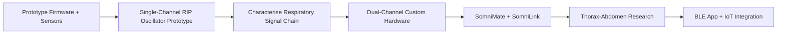
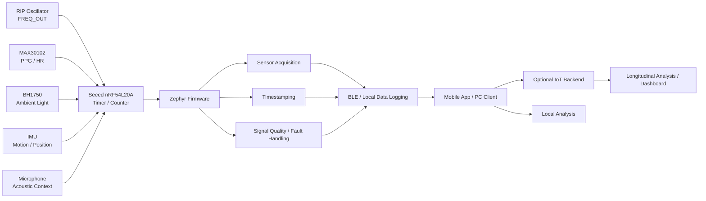
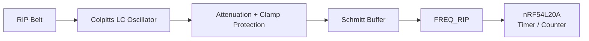
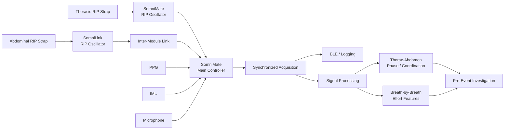
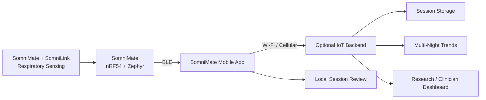
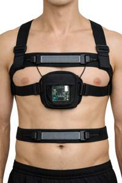

# SomniMate

**Pre-Obstructive Respiratory Signature Research Platform**

SomniMate is an engineering R&D project I am developing to investigate a specific question:

> **Can changes in thoracic and abdominal respiratory mechanics reveal a repeatable signature before an obstructive respiratory event?**

I am approaching the project as a hardware-first investigation. My priority is to acquire good respiratory data, understand the signal chain and test the hypothesis before making predictive claims.

The longer-term system concept is a BLE-connected wearable platform. SomniMate would act as the low-power sensing edge device, with a phone or PC client receiving data over BLE. A future mobile app could then provide the Internet gateway to an optional IoT backend for session storage, longitudinal analysis and research/clinician-facing dashboards. The app/cloud layer is intentionally deferred until the sensor chain and physiological value have been demonstrated.

> **Project status:** active research and development. Firmware and sensor bring-up are in progress, and the first custom RIP front-end Rev A architecture has now been calculated and verified in LTspice before transfer into Altium.
>
> SomniMate is not a diagnostic medical device and is not intended for clinical use.

---

## Research concept

Thoracic and abdominal respiratory effort provide two related but independent views of breathing mechanics.

By measuring both channels together I want to investigate:

- respiratory effort amplitude
- breath-to-breath effort trends
- thorax-abdomen timing
- phase and coordination
- temporary respiratory discordance
- paradoxical movement
- waveform morphology
- changes occurring before, during and after respiratory events

I will use supporting signals such as PPG, movement, position, audio and ambient light as additional context rather than primary respiratory measurements.

I am not assuming that thoraco-abdominal paradox occurs before an obstructive event. The purpose of the project is to determine experimentally whether useful and repeatable pre-event changes are present.

---

## Development strategy

I am developing SomniMate as a staged engineering project. I first established the Nordic/Zephyr firmware and modular sensor platform, and I am now developing the respiratory-effort electronics separately so I can characterise the RIP measurement chain from first principles.

My immediate engineering goal is not a finished wearable or cloud platform. It is to establish a reliable single-channel respiratory-effort signal chain, understand its electrical and mechanical behaviour, and use measured results to drive the later integrated hardware.

---

## Firmware and sensor prototype

For the current development platform I am using:

- **Seeed nRF54L20A development board** — main controller and firmware platform
- **ADS1115 development board** — general analog acquisition and firmware development; no longer required in the primary RIP signal path
- **MAX30102 development board** — experimental PPG / heart-rate / SpO₂ channel
- **BH1750 development board** — ambient-light and recording-context channel
- IMU for movement and position
- microphone for acoustic / snoring investigation
- Zephyr firmware
- BLE / data logging

I originally evaluated the ADS1115 as part of the respiratory acquisition path. After selecting a frequency-output RIP architecture, I no longer need an ADC in the primary RIP channel. The nRF54L20A can measure the oscillator frequency directly using a hardware timer/counter.

**[View the current firmware development](firmware/)**

---

## Custom RIP front-end prototype

For Rev A I selected a **discrete common-base Colpitts oscillator** so that RIP-belt inductance changes are represented directly as frequency changes.

The provisional model uses a 2 µH belt inductance, 2 Ω series-loss model and 1 nF / 1 nF Colpitts capacitive divider. I calculated a nominal resonance of approximately **5.03 MHz**; LTspice produced approximately **4.9 MHz** for the nominal case. Sweeping the assumed belt inductance from 1.5 µH to 2.5 µH produced approximately 5.6 MHz to 4.4 MHz, confirming the expected frequency sensitivity.

The oscillator simulation also showed that the raw resonant waveform requires conditioning before it reaches the Nordic MCU. I therefore added attenuation, Schottky limiting and a Schmitt-trigger stage to produce a clean **0–3.3 V `FREQ_RIP`** signal for direct timer/counter measurement.

**[View the RIP AFE design, calculations and LTspice verification →](hardware/SomniMate_RIP_AFE_Prototype/)**

---

## Intended dual-channel architecture

The later system is intended to contain two coordinated respiratory-effort modules:

- **SomniMate** — main controller and first respiratory-effort channel
- **SomniLink** — second respiratory-effort channel

I have intentionally not fixed the eventual SomniLink-to-SomniMate interface yet. Synchronization, signal quality, size and power will drive that decision.

---

## Planned connected system architecture

SomniMate is intended to become the edge node of a connected monitoring platform without requiring Wi-Fi or cellular hardware in the wearable itself.

The intended division of responsibility is:

- **SomniMate wearable** — sensor acquisition, timestamping, signal-quality checks, local buffering and BLE communication.
- **Mobile app / PC client** — pairing, device status, recording control, data transfer, basic visualization and acting as the Internet gateway.
- **IoT backend** — optional later layer for synchronized session storage, longitudinal trend analysis, algorithm development and remote dashboards.

This keeps the body-worn hardware focused on sensing, synchronization and low-power BLE while allowing Internet connectivity to evolve independently. No app, cloud service or remote monitoring claim is part of the current hardware proof of concept.

---

## Wearable concept

My current mechanical concept uses separate thoracic and abdominal effort straps with a centrally mounted controller. It is an early development concept intended to explore sensor placement, cable routing and wearable integration rather than final industrial design.

**[View image in assets](assets/images/somnimate_wearable_concept.jpg)**

---

## Supporting sensors

### MAX30102

I am using the MAX30102 experimentally for:

- PPG waveform acquisition
- heart rate
- pulse amplitude changes
- experimental SpO₂ investigation

I am treating SpO₂ as experimental until the complete optical implementation and measurement method have been validated.

### IMU

I am using the IMU to investigate:

- body position
- posture changes
- movement detection
- motion artefacts

### Microphone

I am using the microphone experimentally for:

- snoring
- airway acoustic activity
- respiratory-event context

### BH1750

I added the BH1750 as a contextual sensor rather than a primary respiratory sensor. It can provide ambient-light level, lights-on / lights-off transitions and additional timestamped context during recordings while also giving me another useful I²C peripheral during firmware development.

---

## Development status

### Firmware and modular sensors

- [x] Core research question defined
- [x] Nordic / Zephyr environment established
- [x] Initial firmware bring-up
- [x] I²C communication established
- [x] ADS1115 evaluated
- [x] MAX30102 evaluated
- [x] Integrate ADS1115 and MAX30102 into common application
- [x] Add BH1750
- [x] Integrate IMU
- [x] Integrate microphone
- [ ] Implement synchronized timestamping
- [ ] Implement structured data logging
- [ ] Add RIP frequency measurement using Nordic timer/counter

### RIP front end

- [x] Create dedicated Altium RIP prototype project
- [x] Establish schematic / PCB / library / output project structure
- [x] Define Rev-A design criteria
- [x] Compare discrete and dedicated inductance-conversion architectures
- [x] Select discrete Colpitts oscillator for Rev A
- [x] Establish provisional 2 µH belt model
- [x] Calculate nominal LC resonance
- [x] Select and bias TMBT3904 oscillator device
- [x] Build LTspice oscillator model
- [x] Run RIP inductance sweep
- [x] Evaluate belt series-resistance / Q sensitivity
- [x] Add attenuation and Schmitt-trigger output conditioning
- [x] Verify clean 0–3.3 V `FREQ_RIP` output in LTspice
- [ ] Complete the Altium schematic
- [ ] Design the prototype PCB
- [ ] Assemble and bring up the prototype
- [ ] Characterise actual belt inductance / sensitivity / losses
- [ ] Capture controlled respiratory waveforms

### Dual-channel SomniMate / SomniLink hardware

- [ ] Convert measured single-channel results into the dual-channel architecture
- [ ] Design SomniMate controller hardware
- [ ] Design SomniLink hardware
- [ ] Define inter-module communication
- [ ] Build and bring up custom PCBs
- [ ] Verify synchronized thoracic / abdominal operation
- [ ] Evaluate wearable implementation
- [ ] Begin overnight dual-channel data collection
- [ ] Perform thoraco-abdominal phase / coordination analysis

### Connected app / IoT layer — later phase

- [ ] Define BLE GATT services and structured session-data format
- [ ] Prototype SomniMate mobile app or PC client
- [ ] Implement device status, recording control and data transfer over BLE
- [ ] Define secure app-to-backend session upload
- [ ] Prototype optional IoT session storage
- [ ] Add multi-night trend and research-dashboard capability

---

**SomniMate is an independent research and engineering project. It is not a diagnostic or therapeutic medical device.**
