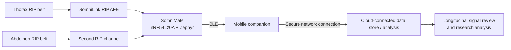

# SomniMate Connected IoT Architecture

SomniMate is being developed as a **connected wearable respiratory R&D platform**. I am treating the system as more than a sensor board: the intended data path runs from body-worn sensing, through embedded processing and BLE, to a mobile companion and optionally onward to cloud-connected storage and analysis.

> **Project status:** the wearable hardware and firmware are being developed first. The mobile and cloud layers below describe the target connected-system architecture and should not be interpreted as completed product features.

## System partitioning

### SomniLink / sensing hardware

The sensor-side electronics convert changes in RIP-belt inductance into a frequency-domain signal suitable for direct timer/counter measurement by the MCU. The current Rev A design uses a discrete Colpitts oscillator, attenuation and Schottky protection, followed by a Schmitt-trigger buffer.

### SomniMate / edge device

The main wearable controller is based around the Nordic nRF54L20A and Zephyr. Its role is to acquire respiratory signals, timestamp and condition the data, perform appropriate edge processing, manage the wearable state and expose the data over BLE.

### Mobile companion

The intended mobile layer provides the BLE gateway, device configuration, session control and local visualisation. It also provides the natural bridge between the low-power wearable and internet-connected services.

### Cloud-connected analysis

A later cloud layer can provide session storage, longitudinal comparison and offline analysis of respiratory patterns. This is an R&D data-analysis architecture rather than a claim of clinical diagnosis or validated medical monitoring.

## Why use BLE rather than connecting the wearable directly to the cloud?

BLE keeps the body-worn electronics small and low power. The phone already provides a display, user interface, internet connection and significantly larger energy budget. This allows SomniMate to remain a low-power sensing and edge-processing device while still participating in a wider connected IoT system.

## Design intent

I am using the project to demonstrate the complete engineering chain rather than treating each PCB as an isolated design:

**sensor physics → analogue/front-end electronics → embedded acquisition → BLE → mobile gateway → connected data analysis**

The mobile and cloud layers will remain clearly marked as planned until they are implemented and demonstrated.