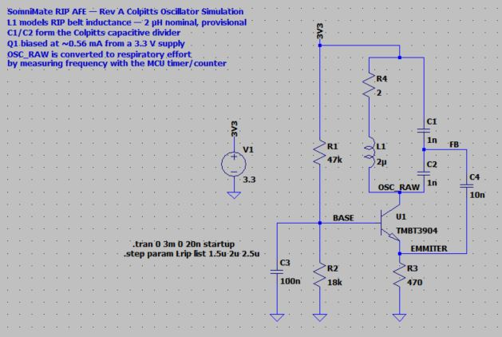
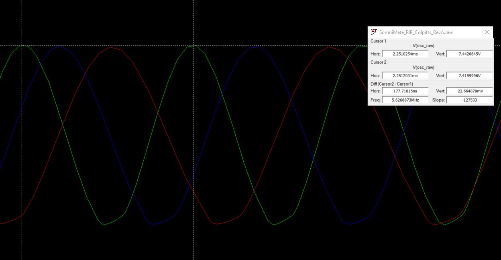
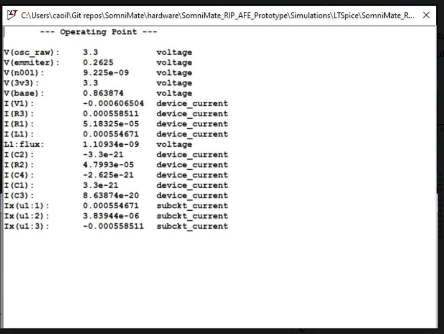
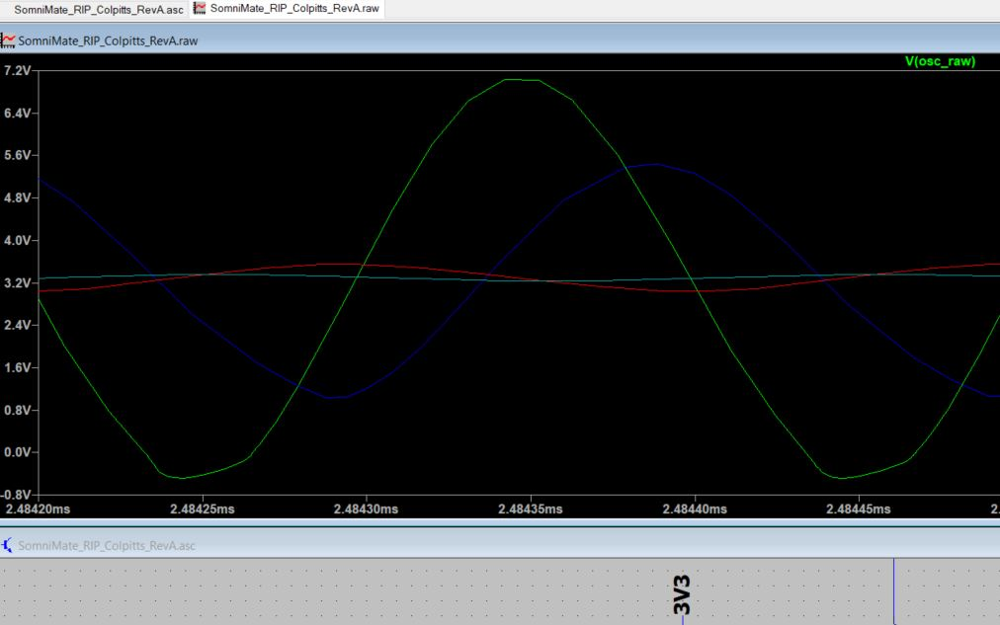
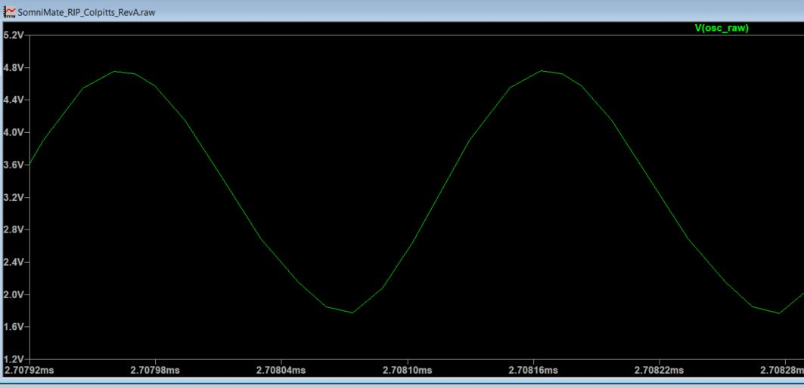
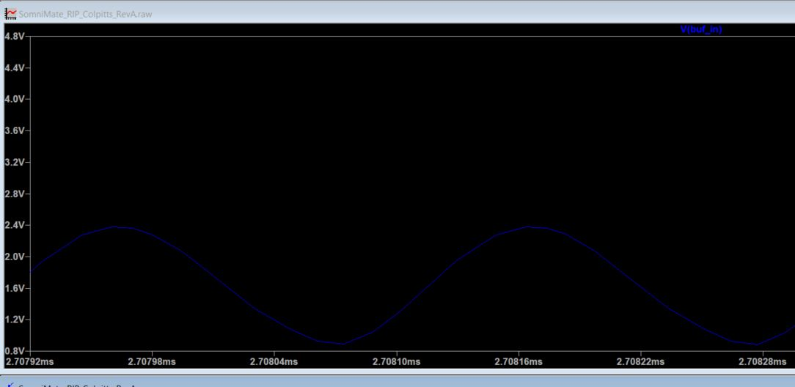
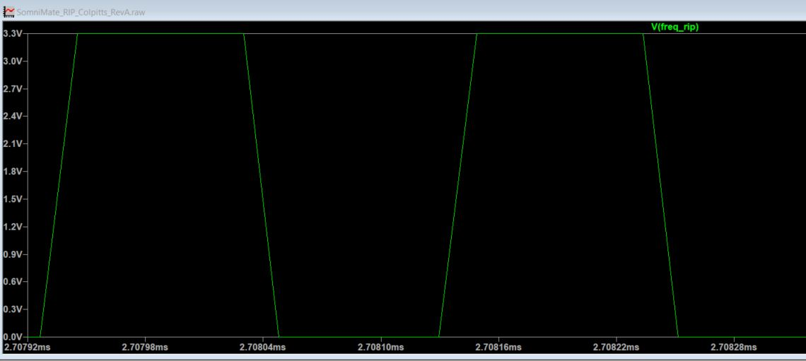
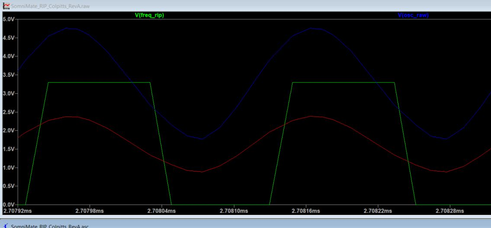

# SomniMate RIP AFE Prototype

**Rev A — Discrete Colpitts respiratory-inductance front end**

This folder is the engineering record for the first custom SomniMate respiratory inductance plethysmography (RIP) front end.

I am using a hardware-first approach: define the sensing requirement, calculate a starting circuit, verify it in LTspice, document the assumptions and then carry the verified design into Altium for PCB development.

> **Status:** Rev A oscillator and digital output-conditioning concept verified in LTspice. Altium implementation is the next step.
>
> This is a non-clinical R&D prototype, not a diagnostic or therapeutic medical device.

---

## Design objective

For Rev A I am deliberately developing **one RIP channel** before duplicating the architecture for synchronized thoracic and abdominal measurements.

My design priorities are:

- small physical size
- low power consumption
- 3.3 V operation
- low component count and BOM cost
- direct interface to an nRF54L20A timer/counter
- relative respiratory-effort measurement rather than calibrated lung-volume measurement
- simple duplication for a second channel
- testability and accessible signal nodes
- tolerance of belt-to-belt electrical variation
- low-voltage battery-powered wearable operation

The current signal chain is:


I chose a frequency-output architecture rather than producing an analog respiratory voltage. This removes the need for an ADC, conventional anti-alias filter and unity-gain op-amp buffer in the primary RIP path.

---

## Architecture choice

I considered four approaches:

1. discrete LC oscillator with MCU frequency measurement
2. dedicated inductance-to-digital conversion, including the TI LDC1612
3. oscillator followed by frequency-to-voltage conversion and ADC
4. synchronous analog excitation/demodulation

For Rev A I selected a **common-base Colpitts oscillator**.

I chose the discrete approach because it keeps the sensing mechanism visible, is compact and low power, and gives me direct control over excitation, loading and output conditioning. It also lets me characterize the unknown RIP-belt electrical behaviour before considering a more integrated converter.

The TI LDC1612 remains a credible later alternative, particularly because one device could potentially support two inductive channels.

---

## Rev A starting model

I do not yet have measured LCR data for the physical RIP belt, so the belt values below are explicitly **provisional modelling assumptions**.

| Parameter | Rev A value |
|---|---:|
| Supply | 3.3 V |
| Q1 | TMBT3904 |
| R1 | 47 kΩ |
| R2 | 18 kΩ |
| R3 | 470 Ω |
| Belt series resistance model | 2 Ω nominal |
| RIP inductance | 2 µH nominal |
| Inductance sweep | 1.5–2.5 µH |
| C1 | 1 nF |
| C2 | 1 nF |
| C3 | 100 nF |
| C4 | 10 nF |
| Output divider R5/R6 | 10 kΩ / 10 kΩ |
| Output clamp | BAT54S-type Schottky clamps |
| Schmitt function | 0–3.3 V logic output |

For the Colpitts divider:

```text
Ceq = (C1 × C2) / (C1 + C2)
    = (1 nF × 1 nF) / (1 nF + 1 nF)
    = 500 pF
```

Using the provisional 2 µH belt value:

```text
f0 = 1 / (2π√(LC))
   ≈ 5.03 MHz
```

This was my first-order design target before simulation.

---

## LTspice verification

### 1. Oscillator implementation

I built the Rev A common-base Colpitts model in LTspice and annotated the circuit with the assumptions and key design intent.



### 2. RIP inductance sensitivity

I swept the provisional RIP-belt inductance using:

```text
.step param Lrip list 1.5u 2u 2.5u
```

The result confirms the expected monotonic relationship: increasing inductance lowers the oscillator frequency.

| Assumed RIP inductance | Ideal calculation | Approx. LTspice result |
|---:|---:|---:|
| 1.5 µH | 5.81 MHz | ~5.6 MHz |
| 2.0 µH | 5.03 MHz | ~4.9 MHz |
| 2.5 µH | 4.50 MHz | ~4.4 MHz |



The small difference between the ideal calculation and simulated result is expected because the hand calculation treats the tank as ideal while the LTspice circuit includes transistor loading and parasitic behaviour.

### 3. Bias and power

The LTspice operating-point analysis gave approximately:

- base voltage: **0.864 V**
- emitter voltage: **0.263 V**
- emitter current: **0.559 mA**
- total supply current: **0.607 mA**

At 3.3 V this corresponds to approximately:

```text
P ≈ 3.3 V × 0.607 mA ≈ 2.0 mW
```



This is a useful first-pass result for a battery-powered wearable sensor channel. I have not yet attempted to optimize the oscillator below this current.

### 4. Belt-loss / Q sensitivity

A real RIP belt is not an ideal inductor. I therefore added a series-resistance model and investigated increasing resonator loss.

The current Rev A topology has strong oscillation margin around the provisional **2 Ω** case, while 5–10 Ω produces substantially reduced amplitude.



---

## Output conditioning

The oscillator simulation also exposed an important interface requirement: the raw resonant waveform is not a safe MCU logic signal.

I therefore added:

- a **10 kΩ / 10 kΩ divider** to attenuate `OSC_RAW`
- small-signal **Schottky clamp protection** around the buffer input
- a **Schmitt-trigger buffer** to convert the sine-like waveform into a clean 0–3.3 V digital signal

For the physical design I intend to use a single-gate Schmitt buffer such as the **SN74LVC1G17**. The LTspice model uses the generic behavioral `schmtbuf` device to verify the transfer concept.

### Raw oscillator waveform



### Attenuated / protected buffer input



### Schmitt output



### Complete signal conversion

The combined plot is the clearest summary of the Rev A signal chain: the resonant waveform is attenuated and then converted to a clean logic-level frequency signal for the MCU timer/counter.



---

## Engineering conclusions from Rev A simulation

The LTspice work has established enough confidence to move into Altium:

- the discrete Colpitts architecture starts and sustains oscillation with the provisional RIP model
- the calculated and simulated nominal frequencies are in close agreement
- frequency responds strongly to the assumed RIP inductance range
- the oscillator operates at approximately 0.61 mA / 2 mW in the current bias configuration
- real belt series resistance / resonator Q will materially affect oscillator margin
- the raw resonant node can exceed normal MCU input levels
- attenuation, limiting and Schmitt edge conditioning provide a practical digital `FREQ_RIP` interface
- the nRF54L20A can therefore measure respiratory information as frequency rather than ADC voltage

---

## Medical-device-aware design considerations

Although this is not being developed as a medical-grade device, I am keeping relevant product-development principles in mind:

- low-voltage, battery-powered body-worn operation
- low excitation energy
- component derating
- fault detectability for belt open/short or oscillator failure
- explicit test points and design verification
- defined assumptions rather than unsupported clinical claims
- EMC awareness around a MHz-range oscillator and external belt conductors
- separation between engineering prototype verification and formal medical-device safety/regulatory work

Formal patient safety, regulatory classification and IEC 60601 compliance are outside the scope of this Rev A prototype and would require specialist review in a medical-device development programme.

---

## Project files

```text
SomniMate_RIP_AFE_Prototype/
├── Schematic/
│   └── RIP_AFE.SchDoc
├── Simulations/
│   └── LTSpice/
│       ├── SomniMate_RIP_Colpitts_RevA.asc
│       ├── SomniMate_RIP_Colpitts_RevA_Buffered.asc
│       └── Images/
├── README.md
└── SomniMate_RIP_AFE_Prototype.PrjPcb
```

---

## Next step

The next engineering step is to reproduce the verified Rev A circuit in Altium with real component selections, decoupling, connector protection and test points, followed by PCB layout.

Physical belt characterization will then replace the provisional 2 µH / 2 Ω model with measured values and determine whether Rev A needs to be retuned before dual-channel development.

---

**SomniMate is an independent research and engineering project. It is not a diagnostic or therapeutic medical device.**
