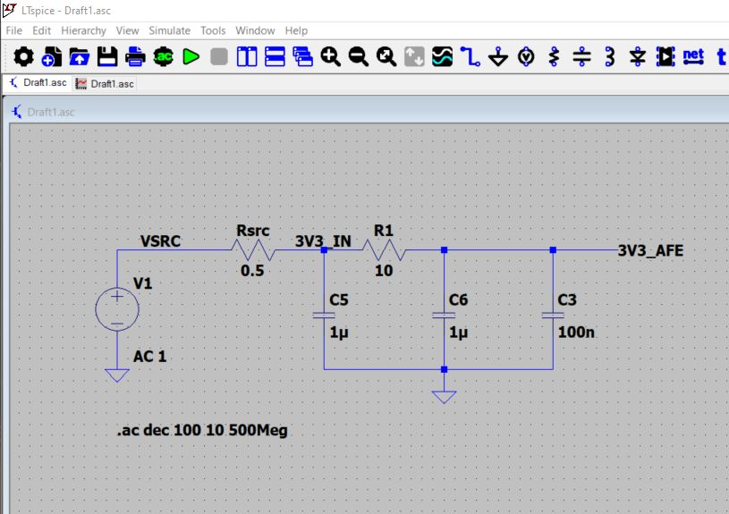
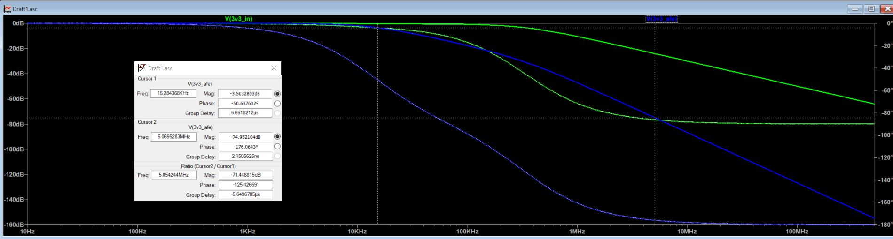
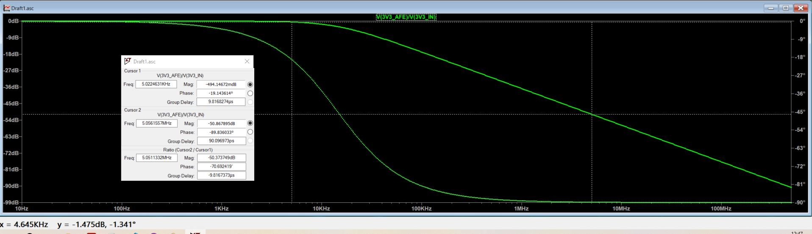

# SomniMate RIP AFE — 3V3 Supply Filter Study

## Purpose

I added a simple **C-R-C supply filter** between the main SomniMate 3.3 V rail and the RIP analogue/front-end supply. The aim is to reduce supply-borne noise from the MCU, BLE activity and other digital circuitry before it reaches the Colpitts oscillator and its output-conditioning stage.

This is an **RC pi-style filter**, not an LC filter. The series element is deliberately a resistor because the RIP AFE current is low and the approach is simple, predictable and easy to prototype.

## Rev A network

```text
                         R8 10R
3V3_IN  -----+----------/\/\/\----------+----- 3V3_AFE
             |                          |
           C5 1uF                    C6 1uF
             |                          |
            GND                       GND
                                        |
                                     C7 100nF
                                        |
                                       GND
```

C6 and C7 are electrically in parallel on the `3V3_AFE` rail. The 100 nF capacitor is retained as a high-frequency local bypass even though an ideal-capacitor AC model shows little difference compared with the 1 uF capacitor alone. In hardware, capacitor ESR, ESL and self-resonant frequency matter.

A separate **100 nF local decoupling capacitor** is also placed directly at the SN74LVC1G17 VCC pin.

## LTspice model

For the standalone AC study I used:

| Element | Value | Purpose |
|---|---:|---|
| Source | AC 1 | Small-signal AC stimulus |
| Rsrc | 0.5 ohm | Simple source/interconnect impedance model |
| C5 | 1 uF | Input-side shunt capacitor |
| R8 | 10 ohm | Series isolation resistor |
| C6 | 1 uF | Output-side bulk/local capacitor |
| C7 | 100 nF | Higher-frequency bypass capacitor |

AC sweep:

```text
.ac dec 100 10 500Meg
```

The source impedance and capacitors are intentionally simplified first-pass models; the results are therefore useful for architecture verification rather than a claim of exact PCB performance.

## Results

The node-to-node AC response shows the filtered `3V3_AFE` rail rolling off while the input rail remains comparatively unchanged. In the current idealised model, the filtered node is approximately **-3.5 dB at 15.3 kHz** relative to the AC stimulus and approximately **-75 dB at 5.07 MHz**.

More usefully, the transfer ratio `V(3V3_AFE)/V(3V3_IN)` shows approximately **-50.9 dB attenuation at 5.06 MHz**. This is particularly relevant because the nominal RIP oscillator operates at approximately 5 MHz.

These values should be treated as simulation results for the simplified network, not measured hardware performance.

## Evidence







## Design decision

I am carrying the filter into the Rev A Altium schematic as:

- `C5 = 1 uF`
- `R8 = 10 ohm`
- `C6 = 1 uF`
- `C7 = 100 nF`
- `C8 = 100 nF` local decoupling at the SN74LVC1G17

The next level of simulation, if required, would use real capacitor ESR/ESL or manufacturer models to examine high-frequency decoupling behaviour more realistically.